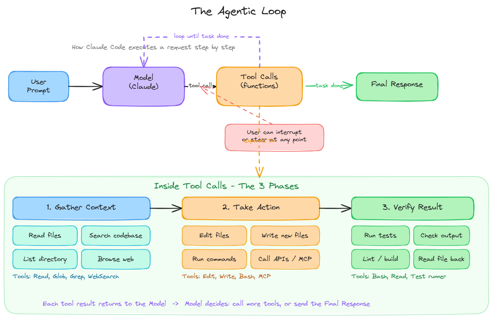

# What are Agentic Coding Tools?

## ELI5 (Explain Like I'm 5)

Imagine hiring a very capable assistant who doesn't just answer questions — they can actually *do things*: open your files, write code, run it, check if it worked, and fix it if it didn't. They work right alongside you in your coding environment.

That's an agentic coding tool. It's an AI that doesn't just chat — it acts.

---

## The Simple Version

```
You describe a goal  →  Agent reads your code  →  Agent edits files  →  Agent runs commands  →  Agent reports back
```

A regular AI answers questions. An agentic coding tool *takes actions* in your development environment.

---

## What can an agentic coding tool do?

| Capability | Example |
|-----------|---------|
| Read your codebase | "Find where this function is defined" |
| Edit files | "Fix this bug across all files" |
| Run commands | "Run the tests and fix any failures" |
| Integrate with tools | "Check this PR and summarize the changes" |
| Multi-step reasoning | "Refactor this module and make sure nothing breaks" |

---

## Where do they live?

Coding agents aren't just one thing — they show up in many places:

| Environment | Example |
|------------|---------|
| Terminal / CLI | Claude Code (`claude` command) |
| IDE plugin | GitHub Copilot, Cursor |
| Desktop app | Claude desktop app |
| Browser | Claude.ai, OpenAI ChatGPT |

---

## Examples of Agentic Coding Tools

- **Claude Code** (Anthropic) — terminal-first, highly capable, general-purpose
- **OpenAI Codex** (OpenAI) — early pioneer, focused on code generation
- **Gemini Code Assist** (Google) — integrated into Google Cloud and IDEs
- **Amazon Q Developer** (formerly CodeWhisperer) — AI coding assistant with deep AWS integration
- **Amazon Kiro** (Amazon) — agentic IDE launched in 2025, spec-driven development workflow
- **Open-source agents** — tools like OpenDevin, SWE-agent, and Aider

> Not all coding agents are the same. Claude Code is broad and flexible — it works across any task in your terminal. Amazon Kiro is a full agentic IDE experience. Amazon Q Developer is a plugin/assistant. Each has different strengths and surfaces.

---

## What makes an agent different from a chatbot?

| Chatbot | Coding Agent |
|---------|-------------|
| Answers questions | Takes actions |
| Reads what you paste | Reads your actual files |
| One turn at a time | Plans and works across many steps |
| Stateless | Aware of your project context |

---

## One-sentence summary

An agentic coding tool is an AI that can read your code, make changes, run commands, and work through multi-step tasks — like a tireless junior developer that lives in your editor or terminal.

---

## What is a Code Harness?

A **code harness** (also called an **agent harness**) is the surrounding program that turns a raw LLM into a useful agent. The LLM alone just predicts text — the harness wraps it with everything needed to actually act in the world.

| Component | What it does |
|-----------|-------------|
| System prompt | Tells the model its role, tools, and rules |
| Tools | Functions the model can call (read files, run commands, search) |
| Memory / context | Keeps track of conversation and project state |
| Sandbox | Safe environment to run code |
| Multi-surface support | Works in terminal, IDE, browser, or via API |

Think of the LLM as a brain, and the harness as the body — the arms, legs, and senses that let it interact with the world.

**Examples of code harnesses:** Claude Code, Cursor, Aider, OpenAI Codex, Continue, Cline, Devin, Sweep, Smol Developer, Open Interpreter, AutoGPT, LangChain, CrewAI.

Most agentic coding tools are code harnesses built around an LLM.

---

## What is Claude Code?

**Claude Code** is Anthropic's agentic coding tool — a code harness built around Claude. It reads your codebase, edits files, runs commands, and integrates with your development tools.

### Where it runs

| Surface | How |
|---------|-----|
| Terminal / CLI | `claude` command |
| IDE | VS Code, JetBrains extensions |
| Desktop app | Mac and Windows |
| Browser | claude.ai/code |

### What it can do

- Automate the work you keep putting off
- Build features and fix bugs end-to-end
- Create commits and open pull requests
- Connect to external tools via MCP (Model Context Protocol)
- Customize with instructions, skills, and hooks
- Run agent teams and build custom agents
- Script and automate via the CLI

### Claude Code's specialization

Claude Code is optimized for software development. While it can also write docs, run builds, search files, and research topics, **code is its core specialty**. It uses an **agentic loop** to complete multi-step tasks from start to finish.

---

## The Agentic Loop



When you give Claude Code a task, it doesn't respond just once — it runs an **agentic loop** until the task is complete.

```
User Prompt → Model → Tool Calls → Model → Tool Calls → ... → Final Response
```

### How the loop works

1. Your prompt goes to the model
2. The model decides what tool to call next
3. The tool runs and returns a result
4. The result goes back to the model
5. The model decides: call another tool, or deliver the final response
6. Repeat until done

### Inside the Tool Calls — 3 Phases

Each tool call generally falls into one of three phases:

| Phase | What happens | Example tools |
|-------|-------------|---------------|
| **1. Gather Context** | Understand the current state of the codebase | Read, Glob, Grep, WebSearch, Bash (list files) |
| **2. Take Action** | Make a change — edit, create, or run something | Edit, Write, Bash (run command), MCP |
| **3. Verify Result** | Confirm the action worked correctly | Bash (run tests), Read (check file), lint |

### You can always interrupt

The loop is not fully autonomous — **you can step in between any tool calls** to:
- Correct the agent if it is heading in the wrong direction
- Add missing context it does not have
- Steer toward a different approach

This keeps you in control even during long automated runs.
